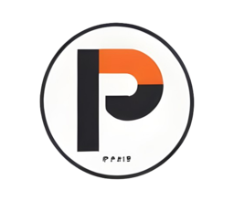

<!-- Improved compatibility of back to top link: See: https://github.com/othneildrew/Best-README-Template/pull/73 -->

<!--
*** Thanks for checking out the Best-README-Template. If you have a suggestion
*** that would make this better, please fork the repo and create a pull request
*** or simply open an issue with the tag "enhancement".
*** Don't forget to give the project a star!
*** Thanks again! Now go create something AMAZING! :D
-->

<!-- PROJECT SHIELDS -->
<!--
*** I'm using markdown "reference style" links for readability.
*** Reference links are enclosed in brackets [ ] instead of parentheses ( ).
*** See the bottom of this document for the declaration of the reference variables
*** for contributors-url, forks-url, etc. This is an optional, concise syntax you may use.
*** https://www.markdownguide.org/basic-syntax/#reference-style-links
-->
[![Contributors][contributors-shield]][contributors-url]
[![Forks][forks-shield]][forks-url]
[![Stargazers][stars-shield]][stars-url]
[![Issues][issues-shield]][issues-url]
[![LinkedIn][linkedin-shield]][linkedin-url]

<!-- PROJECT LOGO -->
 

  

<h3 align="center">pellicola</h3>

  

    A full-stack challenge.
    https://pellicola-frontend-fffb9ff28102.herokuapp.com
     
    <a href="https://github.com/TulioHRC/pellicola"><strong>Explore the docs »</strong></a>
     
     
    <a href="https://pellicola-frontend-fffb9ff28102.herokuapp.com">View Demo</a>
    ·
    <a href="https://github.com/TulioHRC/pellicola/issues">Report Bug</a>
    ·
    <a href="https://github.com/TulioHRC/pellicola/issues">Request Feature</a>
  

### Built With

* [![NestJS]][Nest-url]
* [![React][React.js]][React-url]
* [![PostGres]][PostGres-url]
* [![MUI]][MUI-url]

(<a href="#readme-top">back to top</a>)

<!-- MARKDOWN LINKS & IMAGES -->
<!-- https://www.markdownguide.org/basic-syntax/#reference-style-links -->
[contributors-shield]: https://img.shields.io/github/contributors/TulioHRC/pellicola.svg?style=for-the-badge
[contributors-url]: https://github.com/TulioHRC/pellicola/graphs/contributors
[forks-shield]: https://img.shields.io/github/forks/TulioHRC/pellicola.svg?style=for-the-badge
[forks-url]: https://github.com/TulioHRC/pellicola/network/members
[stars-shield]: https://img.shields.io/github/stars/TulioHRC/pellicola.svg?style=for-the-badge
[stars-url]: https://github.com/TulioHRC/pellicola/stargazers
[issues-shield]: https://img.shields.io/github/issues/TulioHRC/pellicola.svg?style=for-the-badge
[issues-url]: https://github.com/TulioHRC/pellicola/issues
[linkedin-shield]: https://img.shields.io/badge/-LinkedIn-black.svg?style=for-the-badge&logo=linkedin&colorB=555
[linkedin-url]: https://linkedin.com/in/tulio-henrique00
[product-screenshot]: images/screenshot.png
[NestJS]: https://img.shields.io/badge/nestjs-%23E0234E.svg?style=for-the-badge&logo=nestjs&logoColor=white
[Nest-url]: https://nestjs.com
[React.js]: https://img.shields.io/badge/React-20232A?style=for-the-badge&logo=react&logoColor=61DAFB
[React-url]: https://reactjs.org/
[PostGres]: https://img.shields.io/badge/postgres-%23316192.svg?style=for-the-badge&logo=postgresql&logoColor=white
[PostGres-url]: https://www.postgresql.org
[MUI]: https://img.shields.io/badge/MUI-%230081CB.svg?style=for-the-badge&logo=mui&logoColor=white
[MUI-url]: https://mui.com
